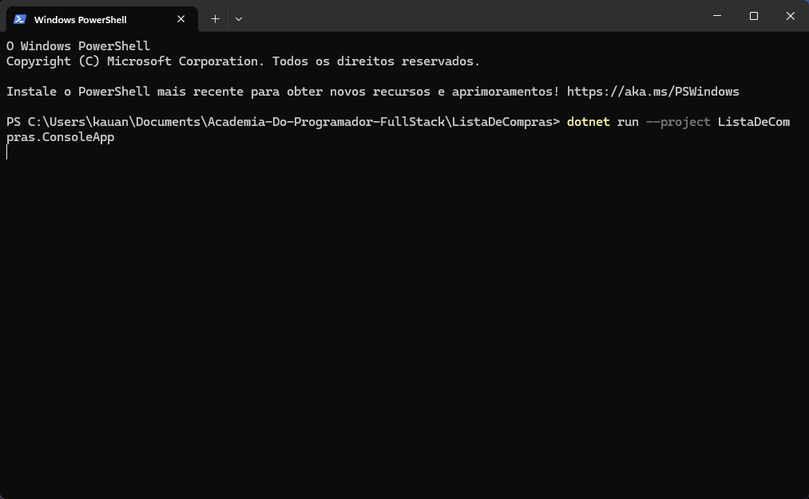

# Lista De Compas

A Lista De Compras é basicamente uma aplicação em console para treinar POO e CRUD, é um sistema simples para cadastrar produtos, organizar listas e registrar as compras realizadas. Desenvolvido em C# na Academia Do Programador Full-Stack.
# Funcionalidades
**Categorias**

* Cadastrar, editar, excluir, listar
Sem nomes duplicados

**Produtos**

* Cadastrar, editar, excluir, listar
* Vinculado a uma categoria
* Não repetir nome na mesma categoria

**Listas de Compras**

* Criar, editar, excluir, listar
* Nome válido, data automática, status
* Mostra total de itens e valor total
* Não excluir lista com itens

**Itens**

* Adicionar, remover, visualizar
* Produto obrigatório, quantidade > 0
* Não repetir produto na mesma lista
* Calcula total automaticamente

## Como Usar?

1. Clone o repositório ou baixe o código comprimido em .zip.
2. Abra o emulador de terminal e navegue até a pasta raiz.
3. Utilize o comando abaixo para restaurar as dependências do projeto.

   ```
   dotnet restore
   ```

4. Em seguida compile e execute o projeto com o comando:

   ```
   dotnet run --project ListaDeCompras.ConsoleApp
   ```

## Requisitos

- .NET SDK 10.0+


